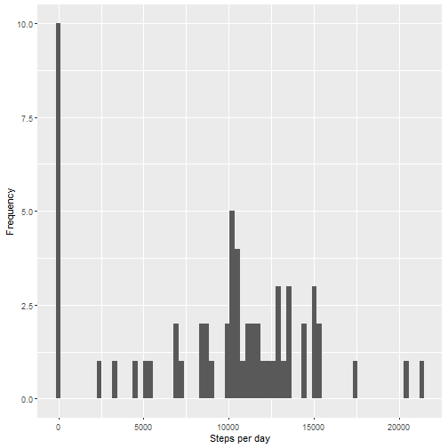
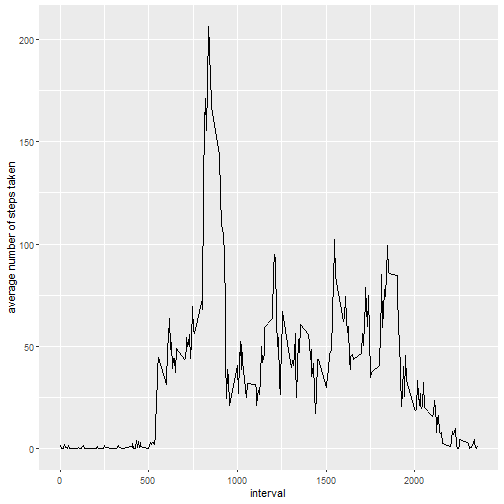
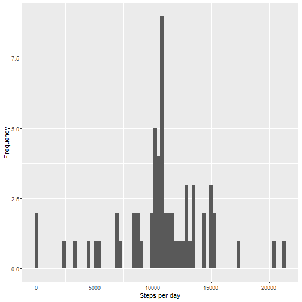
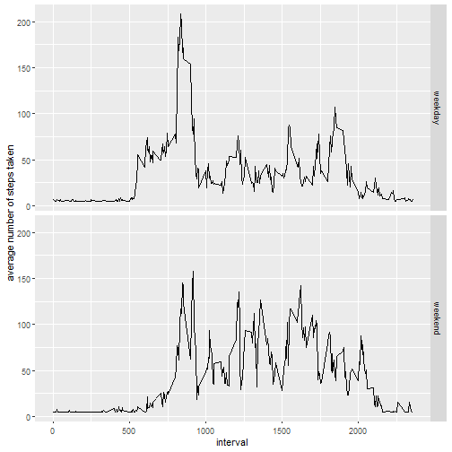

Reproducible Research: Peer Assessment 1
========================================

### 1.Code for reading in the dataset and/or processing the data
Download and unzip the dataset:

```r
filename <- "repdata_data_activity.zip"
if (!file.exists(filename)){
        fileURL <- "https://d396qusza40orc.cloudfront.net/repdata%2Fdata%2Factivity.zip"
        download.file(fileURL, filename, method="curl")
}  
if (!file.exists("activity.csv")) { 
        unzip(filename) 
}

data <- read.csv('activity.csv')

library(lubridate)
data$date <- ymd(data$date)
```

### 2.Histogram of the total number of steps taken each day

```r
library(dplyr)
# Group by the day and calculate the total number steps
steps_num <- group_by(data, date) %>% 
        summarise(steps_per_day = sum(steps, na.rm = TRUE))

library(ggplot2)
qplot(steps_per_day, xlab = 'Steps per day', ylab = 'Frequency',
      data = steps_num, binwidth=300)
```



### 3.Mean and median number of steps taken each day

```r
StepsMean <- mean(steps_num$steps_per_day)
StepsMedian <- median(steps_num$steps_per_day)
```
- Mean 9354.2295082
- Median 10395

### 4. Time series plot of the average number of steps taken
Group by 5-minute interval and calculate average

```r
avg <- group_by(data, interval) %>% 
        summarise(average_steps = mean(steps, na.rm = TRUE))

g <- ggplot(avg, aes(x=interval, y=average_steps))
g + geom_line() + ylab("average number of steps taken") 
```



### 5. The 5-minute interval that, on average, contains the maximum number of steps

```r
max_avg_int <- which.max(avg$average_steps)
max_steps_interval <- avg[max_avg_int, 'interval']
```
Max steps at 835

### 6. Code to describe and show a strategy for imputing missing data

Total number of missing values in the dataset (i.e. the total number of rows with NAs)

```r
nrow(data[is.na(data),])
```

```
## [1] 2304
```
Filling in all of the missing values in the dataset.

```r
# data_imputed <- data
# data_imputed[is.na(data_imputed$steps), 'steps'] <- StepsMean/nrow(data)*nrow(steps_num)
library(Hmisc)
data_imputed <- data
data_imputed$steps <- impute(data_imputed$steps, fun = mean)
```

### 7. Histogram of the total number of steps taken each day after missing values are imputed

```r
steps_num_imputed <- group_by(data_imputed, date) %>% 
        summarise(steps_per_day = sum(steps, na.rm = TRUE))
qplot(steps_per_day, xlab = 'Steps per day', ylab = 'Frequency',
      data = steps_num_imputed, binwidth=300)
```



```r
StepsMean_imputed <- mean(steps_num_imputed$steps_per_day)
StepsMedian_imputed <- median(steps_num_imputed$steps_per_day)
```
- Mean imputed 1.0766189 &times; 10<sup>4</sup>
- Median imputed 1.0766189 &times; 10<sup>4</sup>

### 8. Panel plot comparing the average number of steps taken per 5-minute interval across weekdays and weekends
Create a new factor variable in the dataset with two levels – “weekday” and “weekend” indicating whether a given date is a weekday or weekend day

```r
data_imputed$day_factor <- wday(data_imputed$date)
data_imputed$day_factor <- factor(1*(data_imputed$day_factor == 1 | data_imputed$day_factor == 7), labels = c('weekday', 'weekend'))
```
Make a panel plot containing a time series plot of the 5-minute interval (x-axis) and the average number of steps taken, averaged across all weekday days or weekend days (y-axis).


```r
# Filter by day of the week, group by 5-minute interval and calculate average
avg_weekday <- filter(data_imputed, day_factor == 'weekday') %>%
              group_by(interval) %>% 
              summarise(average_steps = mean(steps, na.rm = TRUE))
avg_weekday$day_factor <- 'weekday'
avg_weekend <- filter(data_imputed, day_factor == 'weekend') %>%
              group_by(interval) %>% 
              summarise(average_steps = mean(steps, na.rm = TRUE))
avg_weekend$day_factor <- 'weekend'

# Create merged table
avg_day <- rbind(avg_weekday, avg_weekend)

g <- ggplot(avg_day, aes(x=interval, y=average_steps))
g + geom_line() + facet_grid(day_factor~.) + ylab("average number of steps taken") 
```


