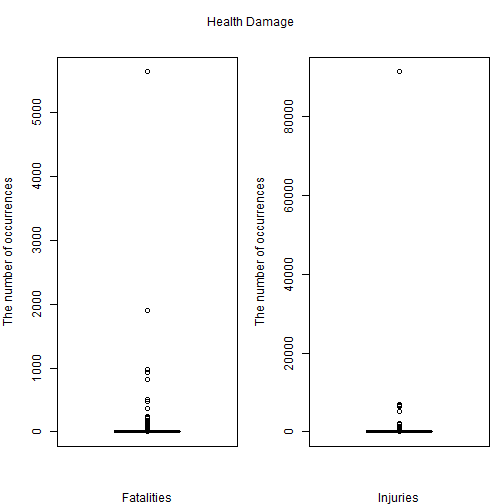
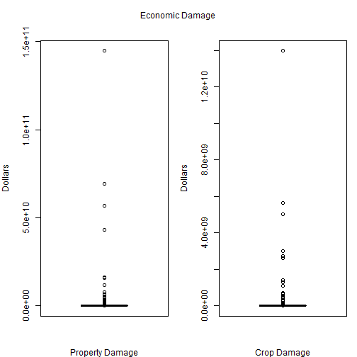

The most harmful with respect to population health and the greatest economic consequences events.
============================================================================

## Synopsis
This project involves exploring the U.S. National Oceanic and Atmospheric Administration's (NOAA) storm database and answers some questions about severe weather events. The events in the database start in the year 1950 and end in November 2011 and includes fatalities, injuries, property and crop damage.  Tornado is the most harmful type of events with respect to population health. 7 types of fatality events and 4 types of injury events are at least 5% of the number of tornado events. Flood and drought are the most harmful type of events with respect to property and crop damage respectively. 7 types of property damage and 10 types of crop damage are at least 5% of the property damage of flood and crop damage of drought respectively.

## 1.Data Processing
### Downloading the dataset:

```r
filename <- "repdata_data_StormData.csv.bz2"
if (!file.exists(filename)){
        fileURL <- "https://d396qusza40orc.cloudfront.net/repdata%2Fdata%2FStormData.csv.bz2"
        download.file(fileURL, filename, method="curl")
}  
data <- read.csv(filename)
```

### Selecting and preprocessing variables
Select variables for analysis and convert alphabetical characters used to signify magnitude (“K” for thousands, “M” for millions, and “B” for billions) to a numeric ones.

```r
DataDamage <- select(data, EVTYPE, FATALITIES, INJURIES, PROPDMG, PROPDMGEXP, CROPDMG, CROPDMGEXP)
DataDamage$PROPDMGEXP <- as.numeric(factor(DataDamage$PROPDMGEXP, levels = c('K', 'M', 'B'), labels = c(1, 2, 3)))
DataDamage$CROPDMGEXP <- as.numeric(factor(DataDamage$CROPDMGEXP, levels = c('K', 'M', 'B'), labels = c(1, 2, 3)))
```

### Library loading

```r
library(dplyr)
```

## 2.Results
### Fatality and injurity events
Group the dataset by type of event (EVTYPE) and find the sums of fatalities and injuries for every event, then find the event with maximum numbers of fatalities and injuries

```r
HealthDamage <- group_by(DataDamage, EVTYPE) %>% 
                summarise(Fatalities = sum(FATALITIES, na.rm = TRUE), 
                          Injuries = sum(INJURIES, na.rm = TRUE))
MaxFatalEvent <- HealthDamage$EVTYPE[which.max(HealthDamage$Fatalities)]
NumFataEvent <- max(HealthDamage$Fatalities)
MaxInjuryEvent <- HealthDamage$EVTYPE[which.max(HealthDamage$Injuries)]
NumInjuryaEvent <- max(HealthDamage$Injuries)
```
Event with maximum numbers of fatalities: TORNADO with numbers of cases 5633  
Event with maximum numbers of injuries: TORNADO with numbers of cases 9.1346 &times; 10<sup>4</sup> 

Make boxplots of values Fataliteis and Injuries for event types

```r
par(mfrow = c(1,2), mar = c(4, 4, 2, 1), oma = c(0, 0, 2, 0))
with(HealthDamage, {
boxplot(Fatalities, xlab = 'Fatalities', ylab = 'The number of occurrences')
boxplot(Injuries, xlab = 'Injuries', ylab = 'The number of occurrences')
mtext('Health Damage', outer = TRUE)
})
```



We see that some other types of events also have significant numbers of occurrences. So we choose events whose number of fatalities is at least 5% of the number of occurrences of TORNADO and number of injuries is at least 5% of the number of occurrences of TORNADO

```r
print(select(HealthDamage, EVTYPE, Fatalities) %>% filter(Fatalities > 0.05 * NumFataEvent))
```

```
## # A tibble: 8 x 2
##   EVTYPE         Fatalities
##   <chr>               <dbl>
## 1 EXCESSIVE HEAT       1903
## 2 FLASH FLOOD           978
## 3 FLOOD                 470
## 4 HEAT                  937
## 5 LIGHTNING             816
## 6 RIP CURRENT           368
## 7 TORNADO              5633
## 8 TSTM WIND             504
```

```r
print(select(HealthDamage, EVTYPE, Injuries) %>% filter(Injuries > 0.05 * NumInjuryaEvent))
```

```
## # A tibble: 5 x 2
##   EVTYPE         Injuries
##   <chr>             <dbl>
## 1 EXCESSIVE HEAT     6525
## 2 FLOOD              6789
## 3 LIGHTNING          5230
## 4 TORNADO           91346
## 5 TSTM WIND          6957
```

### Property and crop damage events
Group the dataset by EVTYPE and find the sum of property and crop damages for every event, then find the event with maximum value of property and crop damages

```r
EconomicDamage <- group_by(DataDamage, EVTYPE) %>% 
                summarise(PropDmg = sum(PROPDMG*1000^PROPDMGEXP, na.rm = TRUE), 
                          CropDmg = sum(CROPDMG*1000^CROPDMGEXP, na.rm = TRUE))
MaxPropDmgEvent <- EconomicDamage$EVTYPE[which.max(EconomicDamage$PropDmg)]
PropDmgEvent <- max(EconomicDamage$PropDmg)
MaxCropDmgEvent <- EconomicDamage$EVTYPE[which.max(EconomicDamage$CropDmg)]
CropDmgEvent <- max(EconomicDamage$CropDmg)
```
Event with maximum of property damages: FLOOD with damage 1.4465771 &times; 10<sup>11</sup> dollars  
Event with maximum of crop damages: DROUGHT with damage 1.3972566 &times; 10<sup>10</sup> dollars  
Make boxplots of values property and crop damages for event types

```r
par(mfrow = c(1,2), mar = c(4, 4, 2, 1), oma = c(0, 0, 2, 0))
with(EconomicDamage, {
boxplot(PropDmg, xlab = 'Property Damage', ylab = 'Dollars')
boxplot(CropDmg, xlab = 'Crop Damage', ylab = 'Dollars')
mtext('Economic Damage', outer = TRUE)
})
```



We see that some other types of events also have significant economic damages. So we choose events whose property damages are at least 5% of the damage of FLOOD and crop damages are at least 5% of the of the damage of DROUGHT

```r
print(select(EconomicDamage, EVTYPE, PropDmg) %>% filter(PropDmg > 0.05 * PropDmgEvent))
```

```
## # A tibble: 8 x 2
##   EVTYPE                 PropDmg
##   <chr>                    <dbl>
## 1 FLASH FLOOD        16140811510
## 2 FLOOD             144657709800
## 3 HAIL               15727366720
## 4 HURRICANE          11868319010
## 5 HURRICANE/TYPHOON  69305840000
## 6 STORM SURGE        43323536000
## 7 TORNADO            56925660480
## 8 TROPICAL STORM      7703890550
```

```r
print(select(EconomicDamage, EVTYPE, CropDmg) %>% filter(CropDmg > 0.05 * CropDmgEvent))
```

```
## # A tibble: 11 x 2
##    EVTYPE                CropDmg
##    <chr>                   <dbl>
##  1 DROUGHT           13972566000
##  2 EXTREME COLD       1292973000
##  3 FLASH FLOOD        1421317100
##  4 FLOOD              5661968450
##  5 FROST/FREEZE       1094086000
##  6 HAIL               3025537450
##  7 HEAVY RAIN          733399800
##  8 HURRICANE          2741910000
##  9 HURRICANE/TYPHOON  2607872800
## 10 ICE STORM          5022113500
## 11 RIVER FLOOD        5029459000
```
